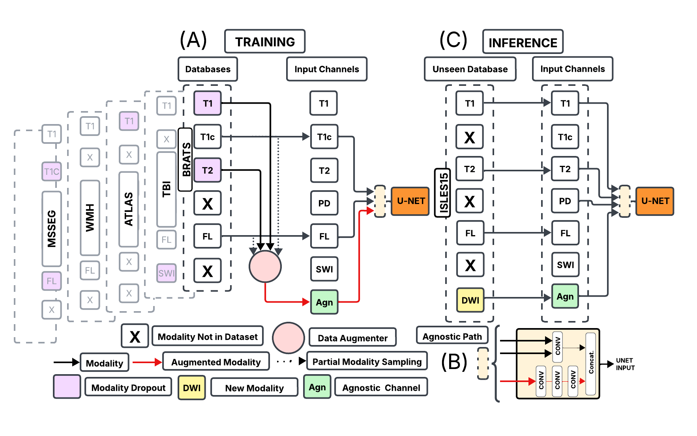
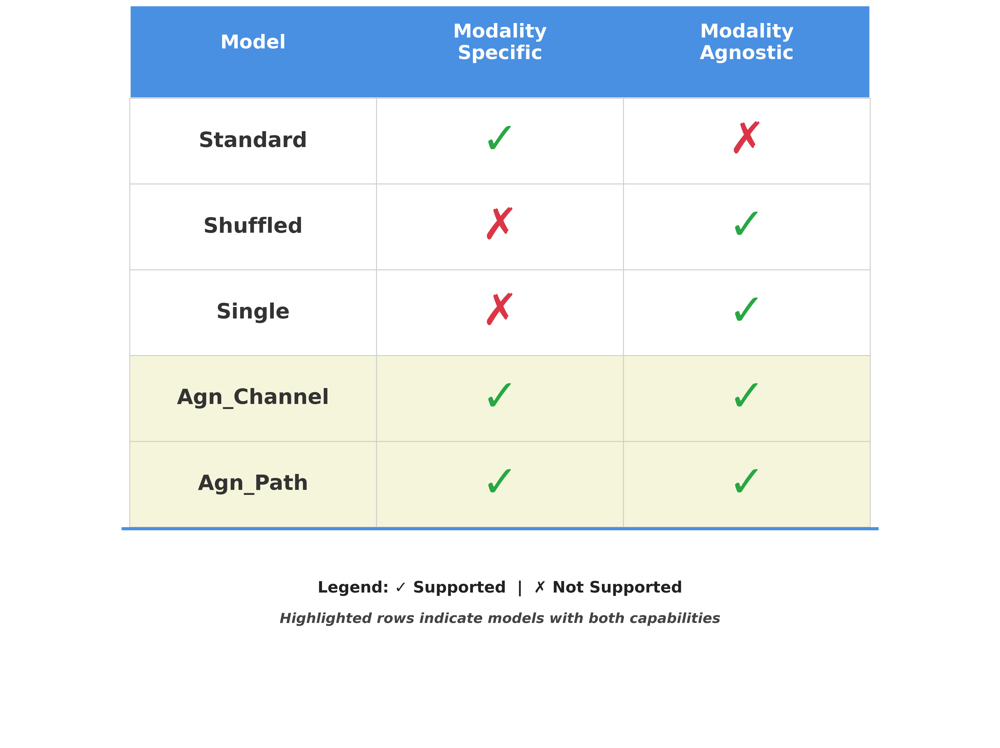

# Modality-Agnostic Input Channels Enable Segmentation of Brain lesions in Multimodal MRI with Sequences Unavailable During Training

This repository contains the Pytorch implementation of the following paper:

 <u>[Modality Agnostic Input Channels Enable... ](https://arxiv.org/html/2509.09290v1)</u>



## Introduction

This work presents a novel **modality-agnostic architecture** for 3D medical image segmentation that  handles heterogeneous combinations of both **seen and unseen imaging modalities**. 

**Key Innovation**: Our approach enables robust brain lesion segmentation even when encountering imaging sequences that were not available during training, addressing a critical challenge in real-world clinical deployment.

**Architecture Design**: We integrate modality-agnostic input pathways with modality-specific processing channels, creating a flexible framework that can adapt to varying modality combinations without retraining.

 **Training Strategy**: The model is trained using innovative **Modality Dropout** techniques and augmentation strategies that synthesize artificial contrasts between brain tissue and lesions, enhancing generalization across diverse imaging protocols.


## Installation
To install code and dependencies clone the repository:
```bash
git clone https://github.com/Anthony-P-Addison/AGN-MOD-SEG.git
```

Create conda virtual environment: 
```bash
conda env create -f environment_current.yml
conda activate agn_mod_seg
```


## Project Structure

```
MultiUnet/
├── config.py          # Configuration settings for training,testing, finetuning  and database  selection
├── train_2.py         # Main training script
├── train_finetune.py  # Fine-tuning script
├── k_fold.py          # K-fold cross-validation implementation
├── masking.py         # Mask generation utilities for datasets. 
├── test.py            # Main test script
├── utils.py           # additional functions 
├── nets.py 
├──      
└── data/              # Dataset directory
    ├── BRATS/
    ├── ATLAS/
    ├── MSSEG/
    └── ...
```

## Usage

The pipeline is set up to be trained on one or more datasets of 3D medical images (in the paper it is segmentation of brain lesions but can be applied to another anatomies/imaging modalities). 


1. Prepare your data:
   ```bash
   # Organize your data in the data/ directory according to the dataset structure. Corresponding labels must be in same order directory as images. Name the same.
   data/
   ├── DATASET_NAME/
   │   ├── Images/
   │   └── Labels/
   ```

2. Create brain masks to allow application of tissue specific augmentations. Corresoponsing masks will be located in the same directoy as the corresponding images and labels. 
   
   ```bash
   python masking.py --datasets "DATASET1"
   ```

   Saved to mask folder as follows:

   ```bash
   data/
   ├── DATASET_NAME/
   │   ├── Images/
   │   ├── Labels/
   │   └── Masks/
   ```


2. Configure settings:
   - Adjust parameters in `config.py` according to your needs
      - add your own databses in the config file under the database config EXAMPLE BRATS: 
         ```bash
         channels["BRATS"] = ["FLAIR", "T1", "T1c", "T2"]
         ...
         train_size["BRATS"] = 444 
         ...
         total_size["BRATS"] = 484
         ...
         img_path["BRATS"] = "data/BRATS/Images"
         ...
         seg_path["BRATS"] = "data/BRATS/Labels"
         ...
         val_size["BRATS"] = 40 
         ...
         mask_path["BRATS"] = "data/BRATS/Masks"

         ```

      
   - Set up your wandb project if using experiment tracking


## Quick Use

Use pre trained model for inference on data with unseen modality assigned to agnostic channel: 


## Model Architecture

The project implements multiple U-Net variants optimized for multi-modal medical image segmentation.

<!--  -->


**Agn. Path:** Additional agnostic channel and pre processing path for input

**Agn. Channel:** Additional agnostic channel to process new modality input


<u>**Baselines**</u>

The following baselines can be trained/tested and adapted as fit:

**Standard Model:** Train the model with with channels equal to the number of modalities across the training database. ** CANNOT PROCESS UNSEEN MODALITY

**Shuffled:**  Modalities are randomly shuffled between input channels during training.

**Single:**   Single input channel to the model during training modalities randomly assigned. 


## Training 

1. Run training:
```bash
   python train_2.py --device_id 0 --datasets "DATASET1_DATASET2" --modality_remove None
   ```

2. Finetuning:
```bash
   python train_2.py --device_id 0 --datasets "DATASET1_DATASET2" --load_model_finetune_path ..
   ```

3. For k-fold cross-validation:
```bash
   python k_fold.py --device_id 0 --datasets "DATASET1_DATASET2" --k_fold 5 
   ```

## Inference 


1. Run Inference with pre trained model by author:
   ```bash
   python test.py --datasets  --k_fold N

   ```

2. Run Inference with your own trained model:
   ```bash
   python test.py --datasets  --k_fold N

   ```


**Citation**  
When Citing this work, please use:
 ```
@inproceedings{
addison2025modalityagnostic,
title={Modality-agnostic input channels enable segmentation of brain lesions in multi-modal {MRI} with sequences unavailable during training},
author={Anthony P. Addison and Felix Wagner and Wentian Xu and Natalie Voets and Konstantinos Kamnitsas},
booktitle={ML-CDS2025:  Multimodal Learning and Fusion Across Scales for Clinical Decision Support},
year={2025},
url={https://openreview.net/forum?id=zDzkXv0O07}
}
 
 ```


## License

This project is licensed under the MIT license

